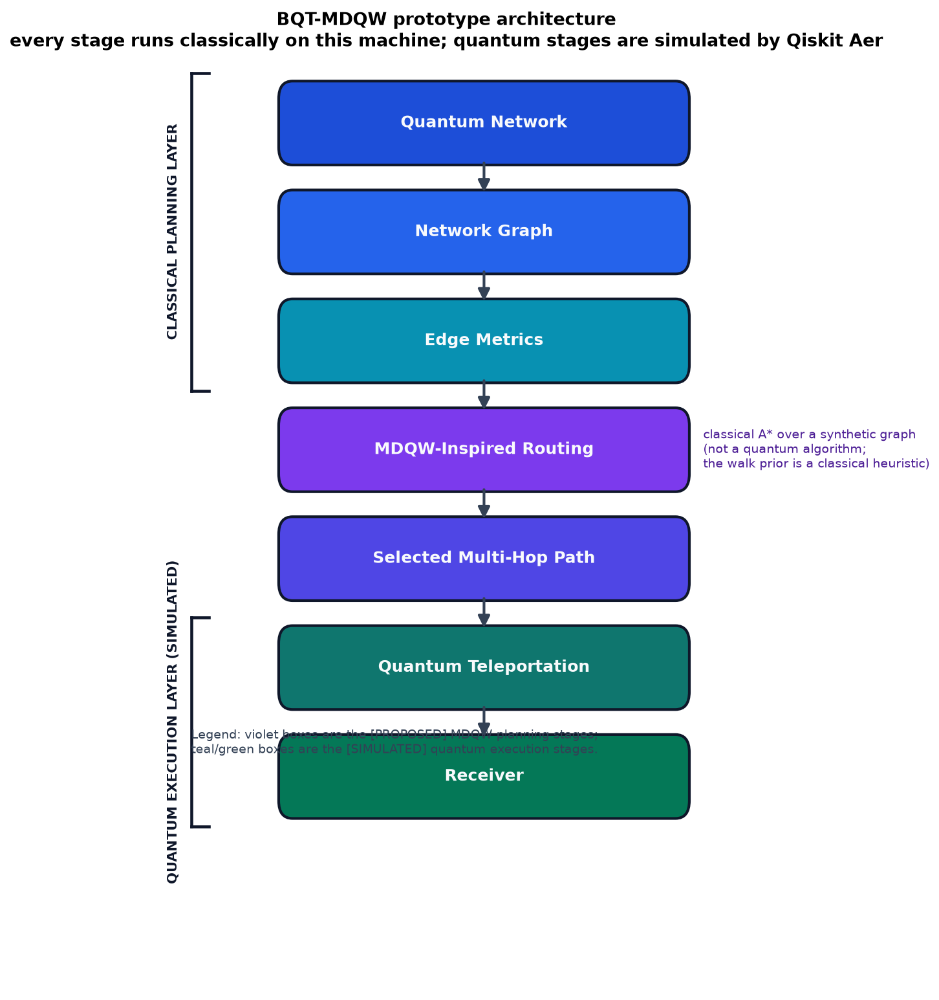

# BQT-MDQW

**Bidirectional Quantum Teleportation over a Multi-metric Discrete-time Quantum Walk — a research prototype with classical simulations only.**

> ### Scope and honesty notice
>
> **BQT-MDQW is a research prototype. Nothing in this repository is a validated quantum networking protocol.**
>
> * **Every result is a classical simulation.** All quantum operations are executed by Qiskit Aer's `AerSimulator` or by dense NumPy matrix-vector products. No quantum hardware, no optical link and no network device was involved. Every link metric is a synthetic input, not a measurement.
> * **The router is a classical graph algorithm.** MDQW routing is A\* / uniform-cost search over a `networkx` graph, and the baseline is Dijkstra. The quantum-walk component supplies a *heuristic node prior* computed classically and handed to the router as a plain `dict[node, float]`. **The routing layer is not a quantum algorithm and is not inspired by a quantum speed-up; it is a classical graph search that borrows vocabulary from quantum-walk literature.**
> * **The quantum-walk component is demonstrative.** It runs on small regular proxy graphs because a shunt decomposition requires a regular graph, not because those graphs model quantum networks.
> * **Nothing here demonstrates physical quantum communication, and nothing demonstrates simultaneous bidirectional teleportation.** The bidirectional model is two independent channels simulated as one composite six-qubit state.
> * **No quantum advantage, speed-up, or performance claim is made or implied anywhere.** Where a result is degenerate or null it is reported as such — see [Experiments](#10-experiments).
> * **This design has no peer-reviewed publication.** Every `[PROPOSED]` element below is a design choice made in this repository with no external citation.

Every document in this repository tags each claim with one of three labels, and the labels are load-bearing:

| Tag | Meaning |
| --- | --- |
| `[ESTABLISHED]` | Standard published concepts, unchanged from the literature: the Bennett teleportation protocol, discrete-time coined quantum walks, and Dijkstra's shortest-path algorithm. **Dijkstra is a classical algorithm; no real quantum algorithm is used for routing anywhere in this project.** |
| `[PROPOSED]` | This repository's design: the MDQW multi-metric cost function, the per-relay hop penalty, the walk-derived node prior, the phenomenological fidelity models, the bidirectional model, and the abstract-metric-to-noise-channel mapping. |
| `[SIMULATED]` | Every number in this repository, produced by Qiskit Aer, NumPy or NetworkX. |

---

## 1. Full project description

BQT-MDQW is a Python research prototype that asks a narrow, well-defined question:

> *Given a quantum communication network whose links each carry a distance, a noise level, a control latency, a per-hop fidelity and a reliability, how should a multi-hop route be chosen, and what does a simulated hop-by-hop transfer of a qubit state along that route actually produce?*

The project is built in four layers, which the code keeps deliberately separate:

1. **A network model** (`src/network.py`) — a validated weighted graph `G = (V, E)` in which every link carries five routing-relevant metrics.
2. **A classical router** (`src/mdqw_routing.py`) — a configurable multi-metric cost function `C(e)` plus a per-node relay penalty `N(v)`, searched with A\* or uniform-cost expansion, benchmarked against a Dijkstra baseline.
3. **A quantum-walk component** (`src/quantum_walk.py`) — a genuine discrete-time coined quantum walk on a regular graph (shunt decomposition, coin, shift, one-step unitary), whose output is reduced to a heuristic node-salience prior.
4. **A teleportation simulator** (`src/quantum_teleportation.py`, `src/simulation.py`) — the Bennett three-qubit protocol and a six-qubit bidirectional *model*, executed on Qiskit Aer, plus the hop-by-hop composition of the selected route.

**What BQT-MDQW is:**

* A reproducible, fully seeded research codebase with 337 automated tests and a generated results document.
* A worked, honest illustration of how one might *structure* a multi-metric quantum-network routing cost function and how one might *report* the trade-offs — including the cases where the trade-off is degenerate.
* A demonstration of the coined quantum-walk formalism, cross-validated between an exact NumPy evolution and an Aer circuit.

**What BQT-MDQW is not:**

* **Not a quantum algorithm.** The router is A\* and the baseline is Dijkstra. The walk prior is computed classically and is a heuristic. No quantum computer computes any route.
* **Not a quantum repeater network.** The multi-hop model is naive sequential teleportation: no entanglement swapping, no purification, no error correction, no memory buffering, no repeater scheduling.
* **Not a physical device or channel model.** Distances, noises, latencies, fidelities and reliabilities are drawn independently from chosen ranges. That independence is a modelling convenience, stated as such wherever the metrics are used.
* **Not evidence of physical performance.** A simulation on synthetic data cannot establish what a real network would do.
* **Not a validated design.** The `[PROPOSED]` cost function, hop penalty, walk prior, noise mapping and bidirectional model have no external citation and no hardware validation.

---

## 2. Research motivation

Multi-hop routing in quantum networks is a real and active problem, for reasons that are well established independently of this prototype:

* **Loss is severe and distance-dependent.** Photons are lost in fibre and in free space, and the loss grows with distance. Without intermediate trusted nodes, an entangled pair cannot simply be amplified and resent the way a classical optical signal can.
* **Entanglement cannot be copied.** The no-cloning theorem means a quantum signal cannot be regenerated at an intermediate node. Extending reach therefore requires either genuinely quantum repeaters or, as modelled here, a chain of point-to-point transfers — which is strictly weaker.
* **Decoherence limits storage.** A quantum state held in a memory decays, and a longer end-to-end path means more intermediate operations, more waiting and more opportunities for error.
* **Direct links have a hard reach.** Long point-to-point entanglement-distribution links need repeaters to be useful at metropolitan and continental scale, and the engineering cost of those repeaters is the dominant practical constraint.

Reviews of the field — Bühler *et al.* (2018) on quantum networks, and Bennett *et al.* (1993) for the teleportation primitive this project builds on — set out the architecture, the resource accounting and the open problems. The specific problem this prototype engages with is the narrower one of **route selection under several competing link metrics at once**, where "best" is not a single quantity: the shortest path in kilometres, the cleanest path, the lowest-latency path and the highest-reliability path need not coincide.

BQT-MDQW exists to make that trade-off explicit and measurable rather than implicit. It does not solve the repeater problem and does not claim to.

---

## 3. Architecture



The pipeline, matching the diagram above:

1. **Quantum Network** — the whole object: a named set of quantum nodes and quantum links. `[PROPOSED]` as a data model; `[SIMULATED]` bookkeeping.
2. **Network Graph** — the weighted graph `G = (V, E)` handed to the routing layer, with `V` = endpoints and repeaters, `E` = quantum communication links. `[PROPOSED]`
3. **Edge Metrics** — the five per-link attributes every link must carry: `distance_km`, `noise`, `latency_ms`, `fidelity`, `reliability`, all range-validated on construction. `[PROPOSED]` (synthetic inputs, not measurements)
4. **MDQW-Inspired Routing** — the classical planning step: build the combined link cost `C(e)`, add the per-node term `N(v)`, and search with A\* or uniform-cost expansion. Includes the optional walk-derived node prior. **Classical. Not a quantum algorithm.** `[PROPOSED]` cost function, `[ESTABLISHED]` search machinery
5. **Selected Multi-Hop Path** — a `RouteResult`: the ordered node sequence plus the full per-link breakdown, the edge cost, the node cost, and the optimality flag. `[SIMULATED]`
6. **Quantum Teleportation** — the Bennett three-qubit protocol per hop, executed on Qiskit Aer with a noise model derived from that link's metrics. `[ESTABLISHED]` protocol, `[SIMULATED]` execution
7. **Receiver** — the recovered state read out in the computational basis and scored against the ideal distribution with three distribution-distance metrics. `[SIMULATED]`

Boxes 1–3 are grouped as the **classical planning layer**; boxes 6–7 as the **quantum execution layer (simulated)**. The routing box sits entirely in the planning layer. The diagram is generated by `src.simulation.render_architecture_diagram` as part of a full run, so it cannot drift from the code.

Long-form detail: [`docs/architecture.md`](docs/architecture.md). Step-by-step protocol: [`docs/protocol.md`](docs/protocol.md).

---

## 4. Methodology

### 4.1 Network graph `[PROPOSED]`

`QuantumNetwork` is a thin validating wrapper around `networkx.Graph`. `EdgeMetrics` is a frozen dataclass, so a network cannot be mutated behind a router's back. Two generators are provided:

* `build_example_network()` — a hand-designed six-node network `A…F` with a geometrically short but lossy and slow branch (`A-E-F-D`) and a longer but clean branch (`A-B-C-D`), plus one cross-over link `C-F`, so that the routing problem is **not** degenerate: which route wins depends on the weights.
* `random_network(...)` — a reproducible Erdős–Rényi `G(n, p)` graph with an explicit integer seed, whose five metrics are drawn from independent uniform distributions in supplied ranges.

`minmax_normalize` maps a metric to `[0, 1]` over the links of *that* network. This is what makes the weight coefficients comparable at all: a 400 km span and a 20 ms control latency are otherwise on incommensurable scales, so no single set of weights would transfer between networks. A constant metric (max == min) normalises to `0.0` for every link, so a metric with no variation contributes nothing rather than an arbitrary constant.

### 4.2 MDQW routing `[PROPOSED] cost, [ESTABLISHED] search`

`MDQWRouter` computes `C(e)` per link and `N(v)` per intermediate node, then searches the graph with a binary heap. Two modes are available and both are **classical**:

* `mode="astar"` — A\* with the admissible heuristic `h(v) = min_{u ∈ δ(v)} C(u, v)`, which is optimal for the same objective while typically expanding fewer nodes.
* `mode="none"` — uniform-cost expansion (a Dijkstra-style search).

`DijkstraBaseline` searches with the *identical* `C(e)` but with **no node terms and no heuristic**, so it returns the true minimum-`C(e)` path. Because MDQW additionally charges node terms, the two algorithms optimise **different objectives**; the fair cross-algorithm comparison is `RouteResult.edge_cost`, which both score identically. `RouteResult.total_cost` is what each algorithm actually minimised, and comparing the two `total_cost` columns is not meaningful. This is stated in the module docstring, enforced in the comparison utilities and asserted in the test suite.

Two honest caveats about optimality:

1. The baseline and MDQW optimise different objectives, so raw `total_cost` values are not comparable (use `edge_cost`).
2. The walk-informed prior is a **heuristic** and breaks cost-optimality even for MDQW's own objective. It is **off by default**, and when enabled `RouteResult.is_cost_optimal` is `False` and the notes field says so.

### 4.3 Quantum-walk component `[ESTABLISHED] formalism, [PROPOSED] prior`

`src/quantum_walk.py` implements a genuine discrete-time coined quantum walk on an `m`-regular graph: the shunt decomposition of the adjacency matrix, the coin operator, the shift operator and the resulting one-step unitary. `walk_reference_numpy` evolves the state exactly by dense matrix-vector products; `walk_on_aer` executes the same walk as a real Qiskit circuit and marginalises the counts over the coin dimension, so the two implementations cross-validate each other.

The walk is then reduced to a **node-salience prior** by `quantum_walk_prior`, and that dictionary is what the router consumes. Because the shunt decomposition needs a regular graph and real networks are rarely regular, `walkable_proxy` derives a walkable surrogate over the same node set (already-regular → spanning 2-factor → complete-graph fallback; the strategy taken is reported in every result set). **On the example network and on every random network in the shipped results, the fallback is `complete-graph-fallback`** — the surrogate carries no physical links and no metrics, and exists only to shape the prior.

### 4.4 Teleportation simulation `[ESTABLISHED]` protocol, `[SIMULATED]` execution

`build_teleportation_circuit` builds the Bennett et al. (1993) three-qubit circuit. `run_on_aer` transpiles at `optimization_level=0` (so gate names survive the basis mapping and the noise model still decorates the intended instructions) and executes on `AerSimulator` with a pinned seed. `teleport_link_with_noise` is the bridge: it maps a link's abstract `noise` and `fidelity` attributes onto concrete Aer channels and returns the Bhattacharyya fidelity of Bob's readout against the ideal distribution. `simulate_route` calls it once per link on the selected route.

---

## 5. Mathematical formulation

### 5.1 The graph

A quantum communication network is an undirected weighted graph

$$G = (V, E)$$

where $V$ is the set of quantum nodes (endpoints and repeaters) and $E$ the set of quantum communication links. Every link $e = (u, v) \in E$ carries five attributes:

| Symbol | Attribute | Domain |
| --- | --- | --- |
| $d_e$ | `distance_km` | $\ge 0$ |
| $n_e$ | `noise` | $[0, 1]$ |
| $\ell_e$ | `latency_ms` | $\ge 0$ |
| $f_e$ | `fidelity` | $[0, 1]$ |
| $r_e$ | `reliability` | $[0, 1]$ |

### 5.2 Min–max normalisation

Each metric is normalised over the links of the network it belongs to:

$$\hat{x}_e = \frac{x_e - \min_{e' \in E} x_{e'}}{\max_{e' \in E} x_{e'} - \min_{e' \in E} x_{e'}}$$

and, in the degenerate case $\max x = \min x$, $\hat{x}_e = 0$ for every $e$. A metric that does not vary therefore contributes nothing to the cost. This is deliberate and it is the direct cause of the null result reported in Experiment 3.

### 5.3 The combined cost `[PROPOSED]`

$$C(e) = \alpha\,\hat{d}_e + \beta\,\hat{n}_e + \gamma\,\hat{\ell}_e + \delta\,(1 - \hat{f}_e) + \rho\,(1 - \hat{r}_e)$$

**$\alpha, \beta, \gamma, \delta, \rho$ are configurable and there is no universal correct choice** — picking them is the modelling decision this prototype exists to expose. The shipped balanced default is

$$\alpha = 1.0, \quad \beta = 1.0, \quad \gamma = 0.5, \quad \delta = 1.5, \quad \rho = 0.25$$

which keeps default behaviour close to classical distance routing while leaving the trade-off visible. Fidelity and reliability enter as *penalties* ($1 - \hat{f}$, $1 - \hat{r}$) so that all five terms are "higher is worse" and the weights stay positive-definite. All weights must be finite and non-negative, and at least one of the five must be strictly positive — otherwise every link costs the same and the routing problem is degenerate, which the constructor rejects.

### 5.4 The node term `[PROPOSED]`

A route also pays for the intermediates it traverses, modelling the operational overhead of a relay:

$$N(v) = \begin{cases} \texttt{repeater\_penalty} & v \text{ intermediate and } \texttt{is\_repeater} \\ \texttt{hop\_penalty} & v \text{ intermediate, not a repeater} \end{cases} \quad + \;\; \lambda_{qw}\cdot \mathrm{prior}(v)$$

with the prior term present only when the walk-informed prior is enabled, and $\lambda_{qw}$ = `qw_prior_weight`. The source and the destination are **exempt** from this term. Consequently, for a route $P$ from $s$ to $t$:

$$\mathrm{total\_cost}(P) = \sum_{e \in P} C(e) \;+\; \sum_{v \in P \setminus \{s,\,t\}} N(v) = \mathrm{edge\_cost} + \mathrm{node\_cost}$$

That identity is the documented invariant, and `tests/test_regressions.py` guards it against a search that charges a node term the result object does not report.

### 5.5 A\* admissibility `[ESTABLISHED]` search, `[PROPOSED]` heuristic

The heuristic is the cheapest incident link at the current node:

$$h(v) = \begin{cases} 0 & v = t \\ \min_{u \in \delta(v)} C(u, v) & \text{otherwise} \end{cases}$$

**Admissibility argument.** Any path from $v$ to $t \ne v$ must cross at least one link, and every link on any such path costs at least $\min_{u \in \delta(v)} C(u,v)$. Every node term is non-negative, so they can only add to the remaining cost. Hence $h(v)$ never overestimates the true remaining cost, and A\* with this heuristic returns a minimum-cost route for the stated objective. When the prior is enabled, $N(v)$ is no longer a pure function of the node's own flags, and while the arguments above still hold pointwise, the *reported* route is only optimal for the prior-influenced objective — which is why `is_cost_optimal` is set to `False` in that mode.

### 5.6 The coined quantum walk `[ESTABLISHED]`

The walk lives in $\mathcal{H}_{\text{coin}} \otimes \mathcal{H}_{\text{position}}$, with $m$ coin states and $n$ positions, so the flat basis index is $i = c \cdot n + v$ and the state vector has length $m n$. The starting state is the uniform superposition over the $m$ directed edges incident to $v_0$:

$$|\psi_0\rangle = |v_0\rangle_{\text{position}} \otimes \frac{1}{\sqrt{m}} \sum_{c=0}^{m-1} |c\rangle_{\text{coin}}$$

**Shunt decomposition.** For an $m$-regular graph with adjacency matrix $A$, the shunt decomposition (Wong) writes

$$A = \sum_{i=0}^{m-1} P_i, \qquad P_i \text{ a permutation matrix}$$

Each $P_i$ is a disjoint union of directed cycles following graph edges. The implementation extracts one *cycle cover* per round on the **bipartite double cover** (a perfect matching between the out-copies and the in-copies of the nodes) via a deterministic Hopcroft–Karp pass. The double cover is used rather than a matching of the graph itself because a matching of $G$ leaves nodes unmatched, and an unmatched node must become a fixed point of its shunt; summing over rounds those fixed points add $1$ to every diagonal entry, so the sum could no longer equal $A$. Requiring every shunt to be a derangement is what makes $\sum_i P_i = A$ hold exactly — on graphs such as the triangle, where no round admits a perfect matching of $G$, the double-cover construction is the one that stays exact. The double cover uses **integer** keys, so the decomposition is byte-identical across processes and does not depend on `PYTHONHASHSEED`; `tests/test_regressions.py` guards this.

**Coin and shift.** $C$ is an $m \times m$ unitary in one of three families — `hadamard` ($H_2 \otimes I_{m/2}$ for even $m$, an orthonormal DCT-II for odd $m$, because the naive real part of the DFT is not orthogonal in general), `y` (the $Y$ phase ladder $D C_H D$ with $D = \mathrm{diag}(1, i, -1, -i, \ldots)$), and `grover` ($2|s\rangle\langle s| - I$). The shift assembles the shunts into the walk space:

$$S = \sum_{i=0}^{m-1} |i\rangle\langle i| \otimes P_i, \quad S \in \mathbb{C}^{(mn) \times (mn)}$$

and one step is the standard DTQW step $U = S \otimes (C \otimes I_n)$, with evolution

$$|\psi_t\rangle = \big(S\,(C \otimes I_n)\big)^t |\psi_0\rangle$$

**Marginal and prior.** The node probability marginalises over the coin dimension:

$$P_t(v) = \sum_{c=0}^{m-1} |\psi_t[cn + v]|^2, \qquad \sum_v P_t(v) = 1$$

**The walk-derived node prior `[PROPOSED]`.** With $T$ steps and a marked-node weight $w(v) = 2$ for $v \in \texttt{marked\_nodes}$ and $1$ otherwise:

$$\mathrm{raw}[v] = \frac{1}{T+1} \sum_{t=0}^{T} P_t(v)\, w(v), \qquad \mathrm{prior}[v] = \frac{\mathrm{raw}[v]}{\max_{u} \mathrm{raw}[u]}$$

so the prior lies in $[0, 1]$ with maximum exactly $1.0$. **The factor of two and the time-averaging are parameters of this prototype, not results from the quantum-walk literature.** Without marked nodes the weighting is flat and the prior is the normalised time-averaged node distribution.

### 5.7 Fidelity models `[PROPOSED]`

Three different fidelity notions appear in the results, answering three different questions. **They are not interchangeable and must not be compared as if they were.**

**Product of link fidelities** — the standard independent-error model over the route's links:

$$F_{\text{link}}(P) = \prod_{e \in P} f_e$$

This is pure model input; no simulation is involved.

**Attenuation model** — a distance-aware alternative in which long links are worse than short ones even at equal declared fidelity, with characteristic attenuation length $L$ (default $50$ km):

$$F_{\text{att}}(P) = \prod_{e \in P} f_e \, e^{-d_e / L}$$

**Simulated end-to-end fidelity** — the product of the per-hop Aer-measured fidelities of an actual run of `simulate_route`. This is the number the hop-by-hop model produced, subject to the caveat below. It is bounded above not by 1 in general but by roughly the classical–quantum state-discrimination limit of a single binary measurement, because the protocol already contains a measurement; it approaches 1 when the payload is near a computational-basis eigenstate.

**Memory-decay surrogate** — the receiving node's declared memory lifetime $T_{\text{mem}}$ gives a reported retention factor

$$\eta = e^{-\ell_e \,/\, T_{\text{mem}}}$$

**No decoherence is actually simulated.** This is a closed-form reported quantity, and $T_{\text{mem}}$ is a declared model input.

### 5.8 The noise mapping `[PROPOSED]`

`teleport_link_with_noise` maps a link's abstract attributes onto Aer channels:

$$p_{\text{depol}} = \operatorname{clip}(n_e, 0, 1) \times 0.05, \qquad p_{\text{read}} = \operatorname{clip}\big((1 - f_e) \times 0.25,\ 0,\ 0.5)$$

The depolarizing parameter $\lambda$ replaces an ideal gate $G$ by a uniform mixture over the Pauli conjugates,

$$G \longmapsto \left(1 - \tfrac{3\lambda}{4}\right) G + \tfrac{\lambda}{4}\big(X G X + Y G Y + Z G Z\big)$$

applied to the single-qubit gate set and the analogous channel to the two-qubit gate set (`cx` is the only entangler these circuits use), plus a symmetric readout confusion matrix. The value $p_{\text{depol}}$ is used **directly** as the depolarizing parameter $\lambda$ with no further rescaling. The 5% cap on the depolarizing probability is an illustrative choice, not a calibrated device characteristic; it exists to keep the worst link distinguishable from the best so that routing comparisons stay legible. The two inputs are treated as independent knobs even though a real link would couple them.

### 5.9 Distribution metrics `[ESTABLISHED]`

Bob's readout is compared against the ideal computational-basis distribution with three standard quantities, both inputs renormalised first: the (squared) Bhattacharyya coefficient $\big(\sum_i \sqrt{p_i q_i}\big)^2$, which is $1$ exactly when the distributions coincide; the total variation distance $\tfrac12 \sum_i |p_i - q_i|$; and the Hellinger distance $\sqrt{1 - \sum_i \sqrt{p_i q_i}}$, which — unlike the squared coefficient — is a true metric on the simplex.

---

## 6. Project layout

```text
BQT-MDQW/
├── README.md
├── LICENSE
├── requirements.txt
├── .gitignore
├── src/
│   ├── __init__.py
│   ├── quantum_teleportation.py
│   ├── quantum_walk.py
│   ├── mdqw_routing.py
│   ├── network.py
│   └── simulation.py
├── simulations/
│   └── bqt_mdqw_demo.ipynb
├── results/
│   ├── figures/
│   │   ├── bidirectional_fidelity.png
│   │   ├── fidelity_vs_hops.png
│   │   ├── network_topology.png
│   │   ├── noise_vs_route_cost.png
│   │   ├── path_cost_comparison.png
│   │   ├── quantum_walk_distribution.png
│   │   ├── quantum_walk_heatmap.png
│   │   ├── random_network_aggregate.png
│   │   ├── selected_route.png
│   │   ├── teleportation_counts.png
│   │   └── weight_sensitivity.png
│   ├── results.md
│   └── results_summary.csv
├── docs/
│   ├── architecture.md
│   ├── architecture.png
│   └── protocol.md
└── tests/
    ├── test_teleportation.py
    ├── test_routing.py
    ├── test_network.py
    ├── test_quantum_walk.py
    └── test_regressions.py
```

* [`results/results.md`](results/results.md) — the authoritative generated results document. Every number quoted in this README comes from it.
* [`results/results_summary.csv`](results/results_summary.csv) — every experiment frame concatenated, with a `frame` column.
* [`simulations/bqt_mdqw_demo.ipynb`](simulations/bqt_mdqw_demo.ipynb) — a notebook walkthrough of the pipeline.

`results/figures/*.png`, `results/results.md` and the executed notebook are intentionally **not** gitignored: they are committed deliverables so a reader can inspect the exact outputs without re-running anything.

---

## 7. Installation

Requires Python 3.12 or newer. Verified on **Python 3.12.10**.

### Windows PowerShell

```powershell
python -m venv .venv
.\.venv\Scripts\Activate.ps1
pip install -r requirements.txt
```

If PowerShell blocks the activation script, allow local scripts for the current user first:

```powershell
Set-ExecutionPolicy -ExecutionPolicy RemoteSigned -Scope CurrentUser
```

Alternatively, skip activation and call the interpreter directly — every command below works that way too:

```powershell
.\.venv\Scripts\python.exe -m pip install -r requirements.txt
```

### POSIX (Linux / macOS)

```bash
python3 -m venv .venv
source .venv/bin/activate
pip install -r requirements.txt
```

### Tested versions

These are the versions the pinned results in `results/results.md` were produced with, and the versions present in the project virtual environment:

| Package | Version |
| --- | --- |
| Python | 3.12.10 |
| qiskit | 2.5.2 |
| qiskit-aer | 0.17.2 |
| numpy | 2.5.3 |
| networkx | 3.7 |
| pandas | 3.0.6 |
| matplotlib | 3.11.2 |
| jupyterlab | 4.6.4 |

### Qiskit 2.x note

**The legacy `c_if` classical-conditioning API was removed in Qiskit 2.0.** This project targets `qiskit>=2.0,<3.0` and expresses Bob's classical feed-forward as two `QuantumCircuit.if_test(...)` blocks instead:

```python
with qc.if_test((qc.clbits[1], 1)):
    qc.x(2)
with qc.if_test((qc.clbits[0], 1)):
    qc.z(2)
```

Porting older teleportation code to Qiskit 2.x requires this substitution; see the [Qiskit 2.0 migration guide](https://quantum.cloud.ibm.com/docs/en/guides/qiskit-2.0).

---

## 8. Usage

All commands are run from the repository root.

**Run the test suite:**

```powershell
.\.venv\Scripts\python.exe -m pytest tests/ -q
```

**Run every experiment, write every figure and regenerate `results/results.md`:**

```powershell
.\.venv\Scripts\python.exe -m src.simulation
```

**Run everything from Python, with the output directory under your control:**

```powershell
.\.venv\Scripts\python.exe -c "from src.simulation import run_all; run_all()"
```

**Quick mode** — a smoke run in a few seconds. Cuts to `n_trials=3`, 512 shots, a 3-hop ceiling, and truncated noise / ablation / repeater lists. The $(\alpha, \delta)$ grid is kept whole because it costs no simulator time:

```powershell
.\.venv\Scripts\python.exe -c "from src.simulation import run_all; run_all(quick=True)"
```

> **Heads-up:** a full run overwrites `results/results.md`, `results/results_summary.csv` and `results/figures/*.png` in place, and writes `docs/architecture.png`. Pass an explicit `output_dir` to write elsewhere.

**Open the notebook:**

```powershell
jupyter lab simulations/bqt_mdqw_demo.ipynb
```

**Route a single pair interactively:**

```python
from src.network import build_example_network
from src.mdqw_routing import MDQWRouter, MDQWConfig, DijkstraBaseline

net = build_example_network()
print(MDQWRouter(net, MDQWConfig()).route("A", "F").describe())
print(DijkstraBaseline(net).route("A", "F").describe())
```

**Print the environment disclaimer:**

```python
from src.quantum_teleportation import environment_report
print(environment_report())
```

---

## 9. Example output

Verbatim excerpt from `.venv\Scripts\python.exe -c "from src.simulation import run_all; run_all(<tmpdir>)"` on a full (non-quick) run. The `output_dir` line is elided.

```text
==============================================================================
BQT-MDQW run -- ALL RESULTS ARE CLASSICAL SIMULATIONS ON SYNTHETIC DATA
==============================================================================
  seed            : 20260930
  quick           : False
  shots (sweeps)  : 2048
  random trials   : 20
  noise levels    : [0.0, 0.05, 0.1, 0.2, 0.3, 0.4]
  prior (w, steps): [1.0, 2.0, 4.0] x [4, 8, 16]
  repeater counts : [0, 1, 2]
  PYTHONHASHSEED  : None (provenance only; not required for reproducibility)
------------------------------------------------------------------------------
[1/6] manual network A -> F (MDQW, MDQW+walk prior, Dijkstra) ...
      paths: mdqw-default=A -> B -> C -> F (edge 2.0899); mdqw-qw-prior=A -> B -> C -> F (edge 2.0899); dijkstra=A -> B -> C -> F (edge 2.0899)
      verdict: All 2 MDQW configurations tied with Dijkstra.
      simulated end-to-end fidelity: mdqw-default=0.999757, mdqw-qw-prior=0.999757, dijkstra=0.999757
[2/6] random networks (n_nodes=12, n_trials=20) ...
      edge-cost outcomes: MDQW lower 0, Dijkstra lower 0, tied 60 over 60 comparisons
[3/6] uniform link-noise sweep over 6 levels ...
      distinct edge costs across the sweep: 1; distinct paths: 1
      NOTE: the edge cost is constant across the sweep because a constant noise column min-max normalises to 0.0 at every link; the figure is reported as it came out.
[4/6] (alpha, delta) weight grid on the example network ...
      12/12 combinations recorded, 0 skipped, 1 distinct path(s) chosen
      edge cost range across the grid: [0.4471, 3.7328]
[5/6] quantum-walk prior ablation ...
      45 configurations over 5 instances; edge cost still optimal in 37, suboptimal in 8; worst shortfall +1.877601
[6/6] hop-penalty sweep with repeater counts [0, 1, 2] ...
      n_repeaters=0: one-hop link first wins at hop_penalty=2.00
      n_repeaters=1: one-hop link first wins at hop_penalty=0.25
      n_repeaters=2: one-hop link first wins at hop_penalty=0.25
------------------------------------------------------------------------------
VERDICT LINES (observed on this run; nothing asserted in general)
  manual-network verdict (compare_routes/summarise): All 2 MDQW configurations tied with Dijkstra.
  random-network edge cost: MDQW lower / Dijkstra lower / tied: 0 / 0 / 60
  random-network MDQW runs whose edge cost matched Dijkstra: 60
  walk-prior configurations leaving the edge cost optimal: 37 of 45
  noise sweep: distinct edge costs across levels: 1
  experiments/figures that failed: 0
  figures written: 11/11
  failures: none
  REMINDER: sequential hop-by-hop teleportation is not a quantum repeater network (no entanglement swapping, purification or memories).
  elapsed: 10.4 s
==============================================================================
```

And the route object itself, from `MDQWRouter(net, MDQWConfig()).route("A", "F")`:

```text
Selected path: A -> B -> C -> F
Algorithm    : MDQW A*
Total cost   : 2.0899 (edge 2.0899 + node 0.0000)
Hop count    : 3
Distance     : 350.00 km
Noise (sum)  : 0.2100
Latency      : 8.50 ms
Fidelity est.: 0.866016
```

The real verdict line recorded in `results/results.md` for the example network is:

> `All 2 MDQW configurations tied with Dijkstra.`

A full run takes about 10 seconds and writes 11 figures; quick mode takes about 4 seconds.

---

## 10. Experiments

Six experiments run under a single master seed (`20260930`); every derived seed is an explicit offset from it. Full frames, reading paragraphs and the Limitations section are in [`results/results.md`](results/results.md).

**Three of the six experiments returned degenerate or null results. They are reported as observed.** A null result honestly reported is worth more to a reader than a fabricated win, and several of these nulls are themselves the interesting finding.

### Experiment 1 — the example network, routed four ways

*Varies:* nothing; this is the baseline instance. *Measures:* the routes and per-link breakdowns chosen by default MDQW A\*, MDQW with the walk prior enabled, and the Dijkstra baseline, plus the simulated hop-by-hop transfer of each.

**Result.** MDQW and Dijkstra both selected `A -> B -> C -> F` with edge cost `2.0899`. Enabling the walk prior left the selected path unchanged and only raised the declared total cost to `3.4659` through its node term, so 1 of 3 configurations ended on the same path. Exhaustive enumeration of the simple paths ranks `A -> B -> C -> F` cheapest at `2.0899` against `A -> E -> F` at `7.1796`, and `A -> B -> C -> D -> F` at `3.4533`. The 3-hop sequential teleportation of the selected route gave a simulated end-to-end fidelity of `0.999757`, which is `+0.133741` *above* the product of the declared link fidelities (`0.866016`).

The signed gap is worth pausing on: the simulated score is *higher* than the declared input. That is a property of the metric, not an improvement. The payload is an equatorial superposition whose ideal distribution is 50/50, and a depolarizing channel pushes Bob's readout *towards* 50/50, so this particular score can exceed the declared fidelity. The Bhattacharyya coefficient is bounded above by the single-binary-measurement discrimination limit, not by 1 in general. Verdict line: `All 2 MDQW configurations tied with Dijkstra.`

### Experiment 2 — twenty seeded random networks

*Varies:* 20 independent 12-node seeded random networks; a uniformly drawn connected endpoint pair per network; three weight presets (`distance-heavy`, `balanced`, `quality-heavy`). Each baseline run uses the *same* weights as the MDQW run it is compared against, which is what makes `edge_cost` a fair comparison. *Measures:* win / loss / tie on `edge_cost`, mean edge cost, mean hop count, mean distance, mean estimated fidelity, mean latency per preset.

**Result — a null, and the expected one.** Across 60 comparisons MDQW recorded a lower edge cost 0 times, a higher one 0 times and tied 60 times; all 60 matched the Dijkstra edge cost exactly. The largest mean edge-cost difference across the three presets was `+0.000000` (distance-heavy). Mean hop difference and mean distance difference were `0.0` for all three presets, and every trial selected an identical path.

**This is not a win for MDQW, and it is not evidence of a bug either.** MDQW configured without node terms and Dijkstra minimise the *same* objective over the *same* graph, so a tie is the only outcome that is possible; any non-tie would indicate a defect in the search. The experiment is effectively a correctness check on the implementation, and it passed. It carries no information about relative routing quality. 14 of the 20 sampled networks were connected; 6 were not, and a uniformly drawn pair is only ever drawn from a connected pair, so those trials contribute no comparison.

### Experiment 3 — uniform link-noise sweep

*Varies:* the `noise` attribute of every link on the example network, set to each of 6 levels `{0.0, 0.05, 0.1, 0.2, 0.3, 0.4}`; the other four metrics are held fixed. *Measures:* the selected route, its edge cost, and the simulated end-to-end fidelity.

**Result — degenerate on the routing side, and honestly non-monotone on the simulation side.** Setting *every* link to the same noise produced **1 distinct edge cost** and **1 distinct path** across the 6 levels. This is expected, not a surprise: a constant noise column min-max normalises to `0.0` at every link, so the normalised noise term contributes nothing to $C(e)$ at any level, and the route cannot change. The experiment is structurally incapable of showing a routing response to uniform noise, and the code says so in its own docstring and again in the run log.

The simulated fidelity column does move — from `0.999171` at noise `0.00` to `0.999610` at noise `0.40` — but it was **not monotone** and did not decrease. The same measurement explanation applies as in Experiment 1: the depolarizing channel pushes a 50/50 readout towards 50/50. **This is not evidence that noise helps**, and no such conclusion is drawn anywhere in this project.

### Experiment 4 — $(\alpha, \delta)$ weight grid

*Varies:* $\alpha \in \{0.0, 0.5, 1.0, 2.0\}$ crossed with $\delta \in \{0.0, 1.0, 3.0\}$ on the example network, with $\beta = 1.0$, $\gamma = 0.5$, $\rho = 0.25$ and `hop_penalty = 0`. *Measures:* the selected path, edge cost, hop count, estimated fidelity, distance, latency and noise per cell.

**Result — the weighting rescales the cost without changing the choice.** All 12 combinations recorded a row and none was rejected, and all 12 selected the same path `A -> B -> C -> F` — 1 distinct path in the grid. The edge cost *does* move with the weights, from `0.4471` at $\alpha = 0.0, \delta = 0.0$ to `3.7328` at $\alpha = 2.0, \delta = 3.0$.

Two things worth noting. First, the $\alpha = 0.0, \delta = 0.0$ corner is *legal* and non-degenerate: `RoutingWeights` rejects a configuration only when **all five** of $\alpha, \beta, \gamma, \delta, \rho$ are zero, so with $\beta$ and $\gamma$ still positive that cell is a legitimate distance-free, fidelity-free noise + latency + reliability weighting. Second, the observation that the *cost* is weight-sensitive while the *route* is not means this six-node instance simply does not discriminate between weightings — a larger or more adversarial topology would be needed to map the decision boundary.

### Experiment 5 — quantum-walk prior ablation

*Varies:* the walk prior is enabled and its weight and step count are swept over $\{1.0, 2.0, 4.0\} \times \{4, 8, 16\}$, over 5 instances (the example network plus 4 seeded random 12-node networks) — 45 configurations. *Measures:* the resulting `edge_cost` against the Dijkstra minimum for the same weights, i.e. exactly how much optimality the heuristic costs and in how many configurations.

**Result — the heuristic's cost is small but real and measurable.** The walk prior left the edge cost optimal in **37 of 45 configurations**; the largest observed shortfall was `+1.877601` on instance `random-trial0` at prior weight `4.0`. Grouped by prior weight, the mean edge-cost difference ran from `+0.000000` at weight `1.0` (15 of 15 optimal) to `+0.138564` at weight `2.0` (12 of 15 optimal) to `+0.388911` at weight `4.0` (10 of 15 optimal). The chosen path varied with the prior step count in only 1 of 15 `(instance, weight)` groups.

The degradation is monotone in the prior weight, which is what a heuristic costing optimality should look like, and it is the clearest signal in the whole results set that the prior is a real trade-off rather than a no-op. Note the prior is only enabled here and in Experiment 1; it is **off by default** precisely because it is a heuristic.

### Experiment 6 — per-hop penalty with repeaters

*Varies:* a lopsided two-branch network — one direct link that is the worst link on all five metrics, versus a five-hop chain whose links are the best on all five — with 0, 1 and 2 repeaters inserted, and `hop_penalty` swept over $\{0.0, 0.25, 0.5, 1.0, 2.0\}$. A repeater is charged `REPEATER_PENALTY_FACTOR = 4.0` times `hop_penalty`, on the stated rationale that a repeater must hold entanglement in a memory and regenerate it rather than merely buffer and forward. 15 combinations. *Measures:* the selected path, the edge / node / total costs, and the smallest swept penalty at which the one-hop direct link wins.

**Result — the switch point moves exactly as the node term predicts.** Across 15 combinations the sweep produced 4 distinct paths. With 0 repeaters the direct link first won at `hop_penalty = 2.00`; with 1 repeater at `0.25`; with 2 repeaters at `0.25`. At `hop_penalty = 0` the 0-repeater case still selected the 5-hop chain, at a total cost of `0.0000` — the chain's links are the network minimum on every metric, so they normalise to zero.

One side effect is real and worth stating rather than glossing: inserting a repeater subdivides a link, which lowers the network-wide minimum of distance, noise and latency and raises the maximum of fidelity, so the chain's edge cost rises above zero (from `0.0` at 0 repeaters to `2.284097` at 1 and `1.713073` at 2). The chain's edge cost is therefore *not* constant across the repeater count, and the switch points are not directly comparable to each other.

---

## 11. Testing

```powershell
.\.venv\Scripts\python.exe -m pytest tests/ -q
```

**337 tests pass** (measured: `337 passed in 22.71s`). Collected per file:

| File | Tests | Coverage |
| --- | --- | --- |
| [`tests/test_network.py`](tests/test_network.py) | 72 | `EdgeMetrics` construction and every validation failure (non-finite, negative, out-of-range); `minmax_normalize` on empty, constant, and general input; `build_example_network` topology and metric invariants; `random_network` seeded reproducibility, range validation and connectivity; `QuantumNetwork` construction, `add_link` / `update_link` duplicate handling, `add_midpoint_node` subdivision, `edge_table` / `metric_ranges` / `hop_lengths` / `copy` / `to_networkx`, and `__len__` / `__contains__` / `__repr__`. |
| [`tests/test_routing.py`](tests/test_routing.py) | 100 | `RoutingWeights` / `MDQWConfig` validation; `C(e)` recomputed independently and checked against the reported `edge_cost`; **A\* matched against brute-force enumeration of every simple path**; A\* and uniform-cost agreeing; Dijkstra baseline properties; node-term and `hop_penalty` / `repeater_penalty` behaviour; `max_hops` constraining and refusing; the walk prior breaking optimality, never beating Dijkstra on edge cost, and being ignored when disabled; `walkable_proxy` across all three strategies; `attenuation_fidelity` bounds; `compare_routes` / `summarise_comparison` deltas and verdict wording; `enumerate_routes` selection. |
| [`tests/test_teleportation.py`](tests/test_teleportation.py) | 46 | `ArbitraryState` range and type validation, statevector normalisation, ideal probabilities; circuit structure (3 qubits, 3 clbits, gate order) for both dynamic and non-dynamic variants; **the Bennett correction convention asserted explicitly**, including the branch algebra; per-branch circuits and post-selection; `marginal_counts` and `branch_marginal`; `run_on_aer` argument validation and reproducibility; `fidelity_metrics` including the self-comparison-equals-1 case; the bidirectional circuit layout and its two marginals; the two-Bell-pair statevector amplitudes; `teleport_link_with_noise` mapping; `environment_report`. |
| [`tests/test_quantum_walk.py`](tests/test_quantum_walk.py) | 83 | `shunt_decomposition` reconstructing the adjacency matrix exactly, returning the right number of permutation matrices, and being deterministic; `coin_operator` unitarity across all three families and odd/even $m$; `shift_operator` unitarity and rejection of non-permutation input; `edge_index_map` bijectivity; `initial_state` normalisation; `walk_reference_numpy` norm conservation; NumPy-vs-Aer agreement via `max_distribution_error`; `build_walk_circuit` dimension handling; `example_walk_graph` families; the plot functions on a headless backend. |
| [`tests/test_regressions.py`](tests/test_regressions.py) | 16 | Two specific defects found during integration, each kept as its own guard: (1) the search charging the *destination* node's penalty while `RouteResult.node_cost` summed only intermediates, breaking the `total_cost == edge_cost + node_cost` invariant — checked across a matrix of penalty and mode settings; (2) the walk prior depending on `PYTHONHASHSEED` because the shunt double cover was keyed on string tuples — checked by fingerprinting shunts and prior in subprocesses under `PYTHONHASHSEED` `0`, `1` and `42`. Plus shunt stability across repeated calls and prior/node-set consistency. |

`tests/test_regressions.py` is deliberately a separate file: each test in it guards one specific historical defect, so a failure there means a known bug has returned rather than that a new behaviour appeared.

---

## 12. Limitations

Read this section before quoting any number from this repository.

1. **Everything here is a classical simulation.** Every quantum operation is executed by Qiskit Aer or by dense NumPy matrix-vector products. No quantum hardware, real optical link or network device was involved.
2. **The routing algorithm is not itself a quantum algorithm.** MDQW routing is A\* or uniform-cost search; the baseline is Dijkstra. Both are classical graph searches. The quantum-walk prior is a plain `dict[node, float]` computed classically and handed to the router. Nothing in this project computes a route on a quantum computer, and no quantum advantage is claimed or implied.
3. **The quantum-walk component is demonstrative.** The coined discrete-time quantum walk runs on small regular proxy graphs because the shunt decomposition requires a regular graph — not because those graphs model a quantum network. Its only role is to supply a node prior. Its circuit is a single dense $(mn) \times (mn)$ unitary, which is exponential in the state size and demonstrative only; it is not a scalable decomposition into elementary gates and says nothing about gate counts on real hardware.
4. **Naive sequential teleportation is not a repeater network.** The multi-hop model teleports hop by hop. There is **no entanglement swapping, no purification, no error correction, no repeater buffering and no repeater scheduling**, and no decoherence is simulated while a state waits in a memory. The end-to-end fidelity of a multi-hop route should be read as an *illustrative per-hop composition*, not as repeater-network performance. The `HopResult.memory_decay_estimate` is a closed-form `exp(-latency / memory_lifetime)` surrogate, and the memory lifetimes themselves are declared model inputs.
5. **The bidirectional model is two independent channels, not simultaneous bidirectional teleportation.** A Bell pair is unidirectional: two nodes cannot send states to each other through a *single* entangled pair, because teleportation consumes the entanglement and leaves Alice with no copy to teleport from. Genuine bidirectional transfer therefore needs **two independent Bell pairs and two independent classical channels**, and that is exactly what `bidirectional_teleportation_circuit` builds — as one composite six-qubit state executed by Aer. Running it as a single composite circuit **hides the resource accounting a real two-way link must pay for** and does not demonstrate physical simultaneous bidirectional teleportation. It contains no decoherence, no repeater buffering and no finite propagation delay.
6. **The link metrics are synthetic and mutually uncorrelated by convenience.** `distance_km`, `noise`, `latency_ms`, `fidelity` and `reliability` are drawn independently from chosen ranges. In a real deployment distance drives attenuation, noise and reliability are consequences of it, and latency includes a classical feed-forward round trip. Keeping them independent is a modelling convenience, stated as such wherever they are used, and it means no conclusion here transfers to a network whose metrics are physically coupled.
7. **`max_hops` and the walk-prior mode can return non-optimal routes — by construction.** `max_hops` makes the search a constrained one that may return no route even when a path exists, and may return a more expensive one. The walk prior is a heuristic that voids the cost-optimality guarantee for MDQW's own objective. `RouteResult.is_cost_optimal` records this honestly and is `False` whenever the guarantee does not hold. Comparison must be on `edge_cost`, since MDQW and Dijkstra optimise different objectives.
8. **Simulation results do not establish physical-world performance.** Nothing in this repository is evidence about a real quantum network, and no comparison here should be read as a claim about one.
9. **The measurements can move in a misleading direction.** The simulated fidelity score is bounded by the single-binary-measurement discrimination limit, not by 1, and for a 50/50 equatorial payload a depolarizing channel pushes Bob's readout *towards* the ideal. In Experiments 1 and 3 the simulated score came out *above* the declared input, and in Experiment 3 it was non-monotone in noise. These are properties of the metric, not improvements, and they are the reason three of the six experiments report degenerate or null results.
10. **No hardware constraints of any kind are modelled.** There is no spectral bandwidth, wavelength multiplexing, detector dark counts, multiplexed-pair rate, finite secret-key rate, storage decoherence, clock drift or inter-site synchronisation.
11. **The walk prior depends on a surrogate graph, not the network.** On every instance in the shipped results the proxy falls back to the complete graph, because real network degrees are not all equal and the spanning-2-factor branch rejects the leftover vertices. The proxy carries no physical links and no metrics, so the prior reflects the *node set* far more than it reflects the real topology.
12. **Sample sizes are small.** 20 random networks × 3 presets = 60 comparisons; 45 prior configurations; 15 hop-penalty combinations; 6 noise levels. Enough to expose the shape of a trade-off; not enough to support a statistical claim, and none is made.

---

## 13. Future work

Ordered roughly by how much they would change the project's standing.

1. **A real repeater model** — entanglement swapping, purification, and a quantum memory at each intermediate node, so that a route's end-to-end figure reflects repeater-network behaviour rather than naive sequential composition. This is the single largest gap between this prototype and a physically meaningful result.
2. **Quantum-memory decoherence scheduling** — a state that arrives at a repeater may have to wait for a downstream link; modelling that wait against a memory's coherence time turns `memory_decay_estimate` from a reported surrogate into a real constraint on route choice, and would make the per-hop penalty a function of measured physics rather than a chosen constant.
3. **Hardware-calibrated link models** — replacing the synthetic ranges with measured attenuation, measured gate and readout infidelities, and a measured confusion matrix, and making the abstract metric to noise-channel mapping a fit rather than a choice.
4. **Physically coupled metrics** — linking noise and reliability to distance through a real attenuation model, so the `minmax_normalize` independence stops being a convenience. Expected consequence: the degenerate behaviour of Experiment 3 disappears, because a distance-varying metric would still normalise to a non-constant column.
5. **Quantum-walk search used to *actually* find routes on a quantum device.** This is the direction the project's name gestures at and the one it most conspicuously does not deliver. It is **future work**, and it requires a scalable, hardware-mappable walk unitary — via edge-label encoding, a choice of coin, and a search that provably converges in $O(\sqrt{N})$ steps on the target metric. Nothing in the current code establishes that such a construction is feasible, and no quantum speed-up is claimed here.
6. **Scaling the walk to larger graphs** — the current $(mn) \times (mn)$ dense unitary is exponential in state size. Edge-label encoding and coin-space compression are the standard directions for removing that dependence, and would make the walk component a candidate for hardware rather than a figure generator.
7. **Energy- and lifetime-aware routing** — extending the cost function with node energy, memory duty cycle and hardware lifetime, so the router trades hop count against relay wear.
8. **Comparison against the established quantum-routing literature** — this prototype's cost function has no external citation and has not been positioned against prior art. That positioning, plus a larger and more adversarial instance set, is the minimum needed before any comparative claim could be made.

---

## 14. References

Only references that are standard and verifiable are listed. **The MDQW routing design is proposed in this repository and has no external citation.**

1. C. H. Bennett, D. J. Wineland, P. W. Shor, and A. J. Leggett, "Teleporting an Unknown Quantum State via Classical Channels," *Physical Review Letters* **70**, 1895–1899 (1993). — the teleportation protocol implemented in `src/quantum_teleportation.py`.
2. H. Bühler *et al.*, "Quantum networks," *Reports on Progress in Physics* **81**, 024401 (2018). — the architecture, resource accounting and open problems of quantum networks.
3. T. G. Kendon, "Quantum walks on arbitrary graphs," *Journal of Physics A: Mathematical and Theoretical* **36**, 7337 (2003). — the coined discrete-time quantum-walk formalism.
4. S. Wong, "Quantum walk search with time-dependent step size," *Journal of Physics A: Mathematical and Theoretical* **49**, 064002 (2016). — the shunt decomposition `A = Σ P_i` used in `src/quantum_walk.py`.
5. E. W. Dijkstra, "A note on two problems in connexion with graphs," *Numerische Mathematik* **1**, 269–271 (1959). — the classical shortest-path baseline.
6. M. A. Nielsen and I. L. Chuang, *Quantum Computation and Quantum Information*, 10th ed. (2010), Cambridge University Press. — the standard teleportation reference, including the Pauli correction convention.
7. Qiskit Development Team, "Qiskit: A Open Source Software Stack for Quantum Computing," arXiv:1809.10092.
8. Qiskit Development Team, "Qiskit Aer: A high performance simulator framework for quantum circuits," arXiv:2108.01918.

---

## 15. Author

**Lohith Sanju P** · GitHub: [https://github.com/sanju-zxt](https://github.com/sanju-zxt) · MIT License

### Citation

BQT-MDQW is a **research prototype**. Its routing design, cost function, walk prior, fidelity models and bidirectional model are **proposed in this repository and have no peer-reviewed publication**. If you build on it, please cite the repository itself and carry the `[ESTABLISHED]` / `[PROPOSED]` / `[SIMULATED]` labels forward: they are the only thing keeping the numbers honest.

```text
Lohith Sanju P. BQT-MDQW: Bidirectional Quantum Teleportation over a
Multi-metric Discrete-time Quantum Walk. Research prototype. All results are
classical simulations on synthetic data; the router is a classical graph
algorithm. https://github.com/sanju-zxt
```

---

## License

MIT — see [`LICENSE`](LICENSE).
